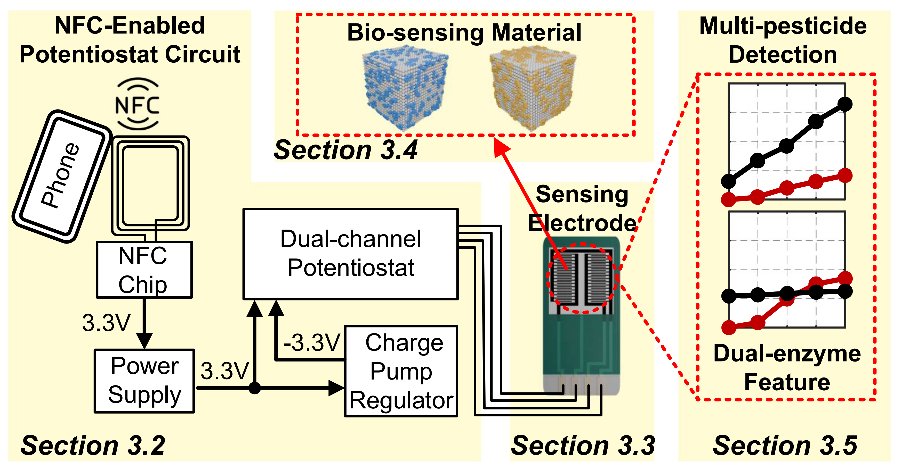
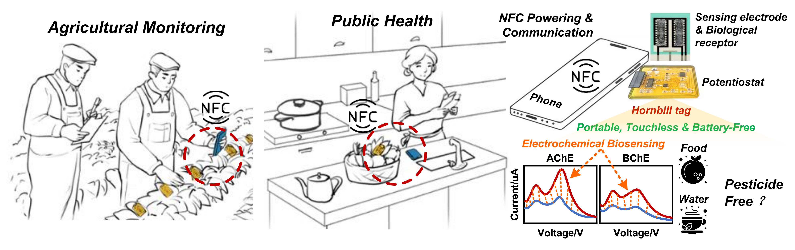

# Pro-Hornbill

|  |This repository is an Open-source code for the MobiCom 2024 conditional acceptance paper "Hornbill: A Portable, High-Precision, and Battery-Free Electrochemical Bio-tag for Pesticide Detection".|
|--|----------|

## Abstract

> Pesticide overuse poses significant risks to human health and environmental integrity. Addressing the limitations of existing approaches, which struggle with the diversity of pesticide compounds, portability issues, and environmental sensitivity, this paper introduces _Hornbill_. A wireless and battery-free electrochemical bio-tag that integrates the advantages of NFC technology with electrochemical biosensors for portable, precise, and touchless multi-pesticide detection. The basic idea of _Hornbill_ is comparing the distinct electrochemical responses between a pair of biological receptors and different pesticides to construct a unique set of feature fingerprints to make multi-pesticide sensing feasible. To incorporate this idea within small NFC tags, we reengineer the electrochemical sensor, spanning the antenna to the voltage regulator. Additionally, to improve the system’s sensitivity and environmental robustness, we carefully design the electrodes by combining microelectrode technology and materials science. Experiments with 9 different pesticides show that _Hornbill_ achieves a mean accuracy of 93% in different concentration environments and its sensitivity and robustness surpass that of commercial electrochemical sensors.

## Overview

## Application

## Quick Start

The paper is currently in a conditional acceptance state, and we will release the relevant code after the official acceptance.

### Contributors

[@Guorong-He](https://github.com/Guorong-He).
[@ChaoZheng109](https://github.com/ChaoZheng109).
[@longsslz](https://github.com/longsslz).
